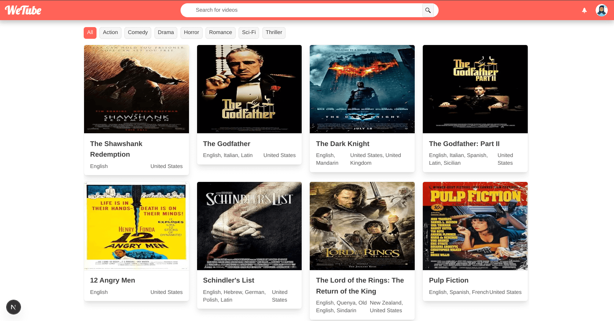
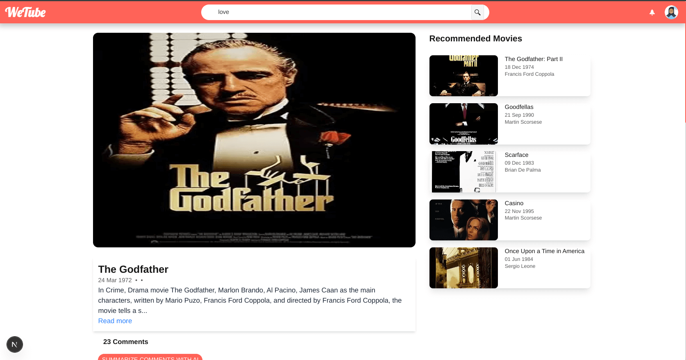
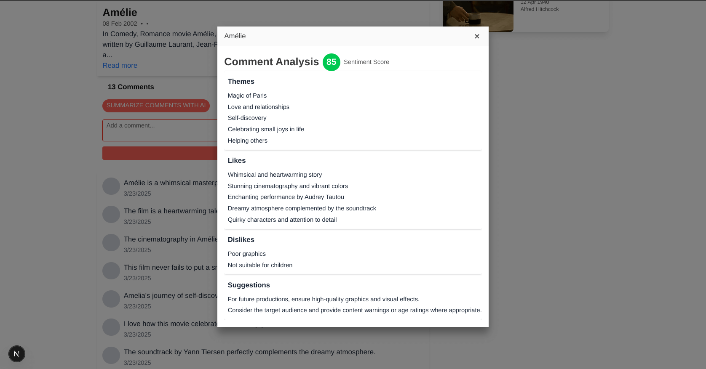
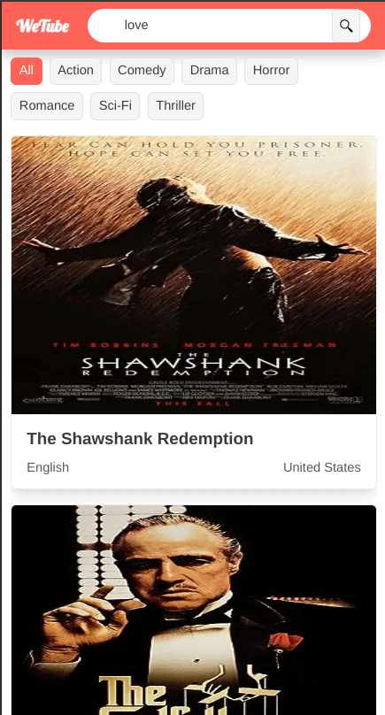

# WeTube - Movie Discovery Platform


WeTube is a modern movie discovery platform built with Next.js, featuring real-time recommendations, vector search, and an interactive user interface powered by KendoUI components.

## 📺 Movie list

## Movie Details with AI powered recommendations

## AI powered comments analysis

## Mobile responsive


## 🌟 Features

- **Advanced Search Capabilities**
  - Vector-based similarity search
  - Real-time movie recommendations
  - Full-text search with MongoDB

- **Modern UI Components**
  - Responsive design with KendoUI React components
  - Infinite scroll for movie listings
  - Skeleton loading states
  - Mobile-first approach

- **Performance Optimized**
  - Server-side rendering with Next.js
  - Image optimization
  - Caching strategies
  - MongoDB vector search integration

- **Accessibility**
  - WCAG 2.1 compliant
  - Keyboard navigation support
  - Screen reader friendly
  - Semantic HTML structure

## 🚀 Tech Stack

- **Frontend**
  - Next.js 15.2
  - React 19
  - KendoUI React Components
  - TailwindCSS

- **Backend**
  - MongoDB with Vector Search
  - Google Gemini AI
  - Langchain
  - Upstash Redis

- **Testing**
  - Playwright for E2E testing
  - Axe for accessibility testing

## 📋 Prerequisites

- Node.js 18.x or higher
- MongoDB Atlas account with Vector Search enabled
- Google AI API key
- Upstash Redis account

## 🛠️ Installation

1. **Clone the repository**
   ```bash
   git clone https://github.com/herberthk/wetube.git
   cd wetube
   ```

2. **Install dependencies**
   ```bash
   npm install
   # or
   yarn install
   # or
   bun install
   ```

3. **Environment Setup**
   Create a `.env` file in the root directory:
   ```env
   MONGODB_URI=your_mongodb_uri
   GOOGLE_API_KEY=your_google_ai_api_key
   UPSTASH_REDIS_URL=your_redis_url
   UPSTASH_REDIS_TOKEN=your_redis_token
   ```

4. **Start the development server**
   ```bash
   npm run dev
   # or
   yarn dev
   # or
   bun dev
   ```

## 🧪 Testing

The project includes comprehensive testing setup:

```bash
# Run all tests
npm test

# Run tests with UI
npm run test:ui

# Debug tests
npm run test:debug

# View test reports
npm run test:report
```

### Test Coverage

- Integration tests for all pages
- Accessibility compliance testing
- Cross-browser compatibility
- Mobile responsiveness
- API integration tests

## 📁 Project Structure

```
wetube/
├── app/                    # Next.js app directory
│   ├── movie/             # Movie details pages
│   ├── search/            # Search results pages
│   └── page.tsx           # Home page
├── components/            # React components
├── lib/                   # Utility functions and actions
│   ├── actions/           # Server actions
│   └── mongodb.ts         # Database configuration
├── public/                # Static assets
├── tests/                # Test files
│   ├── home.spec.ts
│   ├── movie-details.spec.ts
│   ├── search.spec.ts
│   └── accessibility.spec.ts
└── types/                # TypeScript type definitions
```

## 🔄 API Routes

- `GET /api/movies` - Fetch paginated movie listings
- `GET /api/movies/search` - Search movies
- `GET /api/movies/:id` - Get movie details
- `POST /api/movies/:id/comments` - Add movie comments

## 🚀 Deployment

The application is optimized for deployment on Vercel:

1. Connect your GitHub repository to Vercel
2. Configure environment variables
3. Deploy with `vercel deploy`

## 📈 Performance Optimization

- Implemented caching strategies
- Optimized images with Next.js Image component
- MongoDB indexing for faster queries
- Client-side caching for recommendations

## 🤝 Contributing

1. Fork the repository
2. Create your feature branch (`git checkout -b feature/AmazingFeature`)
3. Commit your changes (`git commit -m 'Add some AmazingFeature'`)
4. Push to the branch (`git push origin feature/AmazingFeature`)
5. Open a Pull Request

## 📜 License

This project is licensed under the MIT License - see the [LICENSE.md](LICENSE.md) file for details

## 👏 Acknowledgments

- [Next.js](https://nextjs.org/) for the amazing framework
- [KendoUI](https://www.telerik.com/kendo-react-ui/) for the UI components
- [MongoDB](https://www.mongodb.com/) for vector search capabilities
- [Google Gemini](https://ai.google.dev/) for AI features

## 📞 Support

For support, email herberthk100@gmail.com or [Linkedin](https://www.linkedin.com/in/kavuma-herbert-559496111/).

---

Built with ❤️ by Herbert
